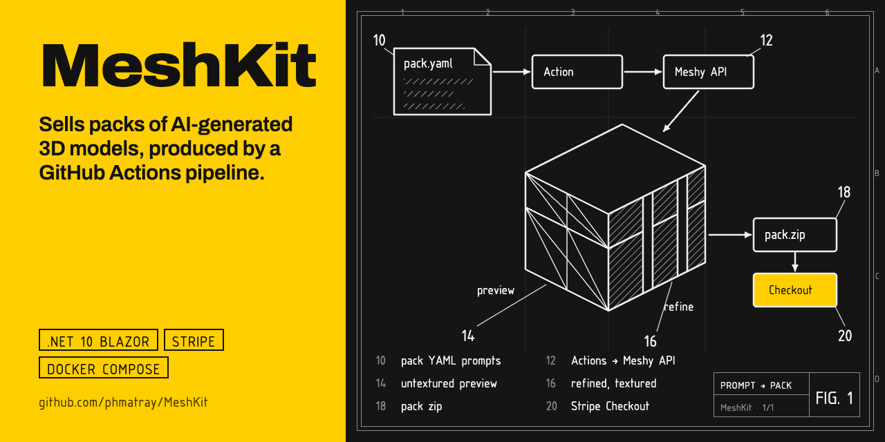

# MeshKit

A small SaaS that sells **packs of 3D models**. The models are generated by a **GitHub Actions
pipeline** through the [Meshy](https://www.meshy.ai) API from prompt files kept in the private
`Atypical-Consulting/meshkit-packs` repository; buyers preview every model in the browser, pay with
**Stripe Checkout**, and download the pack from their library. The whole store deploys with
**one `docker compose up`**.

```
meshkit-packs (private) ──▶ packs/<slug>.yaml ──▶ GitHub Action ──▶ Meshy (preview → refine)
                                                                      │
                                                        pack zip ◀────┘
                                                            ├──▶ Release asset
                                                            └──▶ POST /api/ingest ──▶ store
```

## How it works

| Loop | What happens |
|---|---|
| **Produce** | Write `packs/<slug>.yaml` (name, price, prompts) in the private `meshkit-packs` repository. Run the *Generate pack* workflow here; it checks the manifests out. It calls Meshy once per model — an untextured *preview* (the free in-browser 3D preview) then a textured *refine* (the paid asset) — zips the result, attaches it to a GitHub Release, and optionally pushes it straight into the running store. Re-running resumes: finished models are skipped. |
| **Try** | Each pack can name one `sample` model. `/packs/<slug>/sample` streams that model (all formats, textures, licence) to any signed-in account — no purchase — and records who tried what; the search page has a *Free to download* facet. |
| **Buy** | `/packs` lists sellable packs; `/packs/<slug>` shows thumbnails and a `<model-viewer>` preview of each model. *Buy* opens Stripe Checkout. The **webhook** (`checkout.session.completed` / `async_payment_succeeded`, gated on `payment_status == paid`) grants the entitlement — never the success page. `/library` lists owned packs; `/library/<slug>/download` streams a zip of the textured files. |
| **Operate** | `docker compose up -d` with a `.env`; two bind mounts (`./data` for SQLite + cookie keys, `./catalog` for packs). TLS is your reverse proxy's job. |

## Repository layout

Pack definitions are **not** in this repository. They live in
`Atypical-Consulting/meshkit-packs` (private) and are checked out by the *Generate pack* workflow;
`/packs/` here is gitignored so a local clone of them can never be committed back.

```
src/MeshKit.Core           domain: pack definition (YAML) + pack manifest (JSON), validation, path confinement
src/MeshKit.Meshy          typed HttpClient for api.meshy.ai (preview, refine, poll, download)
src/MeshKit.Pipeline       console tool: generate · zip · publish
src/MeshKit.Web            Blazor (static SSR) store: catalog, accounts, Stripe, downloads, ingest
tests/                     xunit: 100+ tests, including the webhook and downloads through WebApplicationFactory
.github/workflows          ci.yml · docker.yml (ghcr.io image) · generate-pack.yml (the pipeline)
docs/superpowers           design spec and implementation plan
```

## Producing a pack

A pack starts as one YAML file committed to **`Atypical-Consulting/meshkit-packs`** (private), not
here. The schema below is the pipeline's public contract — the prompts, polycount ladder and price
of the actual packs are the product recipe, which is why they are kept separately.

```yaml
# packs/lowpoly-fantasy-props.yaml  — in the meshkit-packs repository
slug: lowpoly-fantasy-props
name: Low-Poly Fantasy Props
description: Eight game-ready fantasy props …
price: { amount: 1900, currency: eur }          # minor units, lowercase ISO code
sample: treasure-chest                         # optional: one model free for any account — "try before you buy"
generation:
  ai_model: latest                               # meshy-5 | meshy-6 | meshy-7 | latest (= Meshy 7) | meshy-t2
  model_type: standard                           # standard | smart-topology (needs meshy-t2)
  should_remesh: true                            # REQUIRED for target_polycount/topology to apply on Meshy 6/7
  topology: triangle                             # triangle | quad
  target_polycount: 4000
  auto_size: true                                # real-world scale, pivot at origin_at (bottom | center)
  alpha_thumbnail: true                          # transparent thumbnails (default)
  ultra_mode: false                              # +5 credits/model; per-model override: `ultra: true`
  lods: [2000, 800]                              # optional, up to 3 levels below target_polycount: Meshy Remesh, 5 credits each
  texture_image: palette.png                     # optional, relative to this file: one reference image for the whole pack
  enable_pbr: true
  texture_resolution: 2k                         # 2k | 4k | 8k
  target_formats: [glb, fbx, obj, usdz]          # glb is mandatory (the preview needs it)
models:
  - slug: treasure-chest
    name: Treasure Chest
    prompt: a closed wooden treasure chest with iron bands, low poly game asset, stylized
    texture_prompt: weathered oak planks, rusted iron bands   # optional; replaces texture_image for this model
    ultra: true                                               # optional; hero pieces only
```

Texture variants (`variants:` on the pack, up to 3 — e.g. `{ slug: snow, name: Snow, prompt: covered in fresh snow }`)
retexture every model's refined mesh with the original UVs kept (Meshy Retexture, 10 credits per model and
variant). They ship under `private/<model>/variants/<slug>/` with their own texture maps, show as selectable
skins in the viewer, and like LODs are added to an existing pack by a rerun without `regenerate`.

LODs are a separate, resumable stage: re-running the workflow (without `regenerate`) on an existing pack adds
the missing levels from the refine task — no model is regenerated, 5 credits per level. They ship as
`private/<model>/lod1/<model>_lod1.<fmt>` next to the full model and are listed on the pack page.

The free in-browser previews are shrunk by `tools/optimize-previews.sh` (textures capped at 1k and
re-encoded as WebP, geometry untouched — ≈0.4 MB instead of 7 MB per model). The workflow runs it after
generation; it costs no credits, so re-running the workflow *without* `regenerate` applies it to an
existing pack.

The validator refuses a `target_polycount` without `should_remesh: true` — Meshy silently ignores the budget
otherwise, and the first fantasy pack shipped a 22k-triangle campfire that way.

1. Commit the manifest to `Atypical-Consulting/meshkit-packs` under `packs/<slug>.yaml`.
2. Add the repository secrets `MESHY_API_KEY` and `MESHKIT_PACKS_TOKEN` (a fine-grained PAT with
   *Contents: read* on `Atypical-Consulting/meshkit-packs` and nothing else). Optionally
   `MESHKIT_INGEST_URL` (`https://<store>/api/ingest`) and `MESHKIT_INGEST_TOKEN` (the store's
   `MESHKIT__INGEST__TOKEN`).
3. *Actions → Generate pack → Run workflow*, slug `lowpoly-fantasy-props`, tick *publish* to push it
   into the store.
4. Check credits first — each model costs roughly 15–30 Meshy credits (preview + refine).

Locally, the same tool runs with `MESHY_API_KEY` exported. These commands assume a clone of
`meshkit-packs` at `./packs` (gitignored), which is what the workflow stages too:

```bash
dotnet run --project src/MeshKit.Pipeline -- generate --pack packs/lowpoly-fantasy-props.yaml --out catalog --dry-run
dotnet run --project src/MeshKit.Pipeline -- generate --pack packs/lowpoly-fantasy-props.yaml --out catalog
dotnet run --project src/MeshKit.Pipeline -- zip --pack-dir catalog/lowpoly-fantasy-props --out dist/lowpoly-fantasy-props.zip
dotnet run --project src/MeshKit.Pipeline -- publish --zip dist/lowpoly-fantasy-props.zip --url https://<store>/api/ingest --token …
```

Exit codes: `0` ok · `1` some models failed (manifest kept, rerun resumes) · `2` usage/config error ·
`3` out of Meshy credits.

A generated pack is a directory: `manifest.json`, `public/thumbs/*.png` + `public/preview/*.glb`
(served to everyone), `private/<model>/*` (textured GLB/FBX/OBJ/USDZ + texture maps, served only to
buyers). The store refuses any manifest whose paths escape `public/` or `private/`.

## Deploying the store

The production instance (https://meshkit.atypical.consulting) is described in [DEPLOYMENT.md](DEPLOYMENT.md). For your own host:

```bash
cp .env.example .env            # Stripe keys, public URL, ingest token
mkdir -p data catalog && sudo chown -R 1001:1001 data catalog   # the container runs as uid 1001
docker compose up -d            # pulls ghcr.io/atypical-consulting/meshkit:latest (or `docker compose build`)
```

Then in the Stripe Dashboard add a webhook endpoint `https://<host>/stripe/webhook` for
`checkout.session.completed`, `checkout.session.async_payment_succeeded`,
`checkout.session.async_payment_failed`, and paste its signing secret into `STRIPE__WEBHOOKSECRET`.
Use a **restricted key** (`rk_…`) with *Checkout Sessions: write* as `STRIPE__SECRETKEY`.

Packs reach the catalog either through the pipeline (`publish`) or by unzipping a release asset into
`./catalog/<slug>/` — the store rescans on every ingest and at startup.

For local webhook testing: `docker compose --profile dev up -d` runs `stripe listen` against the
container (set `STRIPE_CLI_API_KEY`), or use the Stripe CLI on the host:

```bash
stripe listen --forward-to localhost:5080/stripe/webhook
stripe trigger checkout.session.completed --add checkout_session:client_reference_id=<userId> --add 'checkout_session:metadata[pack_slug]=<slug>'
```

## Developing

```bash
dotnet build MeshKit.slnx        # runs `npm ci` + Tailwind/model-viewer build the first time
dotnet test  MeshKit.slnx
dotnet run --project src/MeshKit.Web   # http://localhost:5080, catalog = ./catalog, db = ./data/meshkit.dev.db
```

Requires any .NET 10 SDK (10.0.100+) and Node 22+. `-p:SkipNpm=true` skips the asset build (CI and Docker build
the assets in their own step). Secrets for local runs go in user secrets (`dotnet user-secrets set
Stripe:SecretKey rk_test_…`), never in `appsettings.json`.

## Design notes

The full rationale lives in [`docs/superpowers/specs/2026-08-22-meshkit-design.md`](docs/superpowers/specs/2026-08-22-meshkit-design.md).
The short version: pack *definitions* are code, generated *assets* are release artifacts, the database
only holds what the pipeline cannot know (users, orders, entitlements), and fulfilment is driven
exclusively by signature-verified Stripe webhooks, idempotent on the session id.

## Licence

**FSL-1.1-ALv2** — see [LICENSE](LICENSE). You may read, modify, self-host and build on MeshKit for
any purpose except a *Competing Use*: shipping it, or something substantially similar, as a
commercial product or service of your own. Every release converts to Apache-2.0 on its second
anniversary.

MeshKit was MIT until 2026-10-01 and that history stays MIT; the change is not retroactive.
[LICENSE-HISTORY.md](LICENSE-HISTORY.md) records where the boundary falls. The **assets** generated
by the pipeline have always had their own royalty-free licence, shipped inside each pack and served
at `/packs/<slug>/licence` — the code licence does not govern them.
